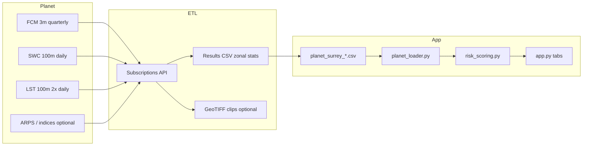

# Demo Plan — Planet Data Feeding Surrey Streamlit Scores

How licensed Planet data would replace the placeholder CSV and extend the BC Hydro vegetation–weather outage risk **concept demo** for Surrey, BC.

Related: [surrey_planet_integration_notes.md](surrey_planet_integration_notes.md), [planet_products_for_surrey.md](planet_products_for_surrey.md), [demo_assumptions.md](demo_assumptions.md).

---

## Architecture overview



**Current state:** Sidebar **Data mode → Planet sample enabled** loads `data/demo/planet_surrey_sample_placeholder.csv` (`data_status=placeholder`). No live Planet API calls.

**Target state:** Scheduled ETL writes `data/processed/planet_surrey_live.csv` (or pulls from object storage) with `data_status=loaded`; same loader/scoring path unchanged.

---

## Planet → CSV field mapping

| CSV column | Planet source (Products A–F) | ETL aggregation |
| --- | --- | --- |
| `aoi_id` | Fujitsu-defined (`SURREY-TX-BUF-200M`, etc.) | From AOI Features Manager ref |
| `area_hectares` | Computed from AOI polygon | EPSG:3005 area / 10,000 |
| `vegetation_cover_green_pct` | A — forest classifier / NDVI from ARPS or Area Monitoring | Mean green fraction × 100 over AOI |
| `vegetation_cover_brown_pct` | A — Bare-Soil Marker or (1 − NDVI) stress | Mean brown/senescent fraction × 100 |
| `non_vegetation_pct` | A — built-up + water classifiers | Remainder or explicit sum |
| `canopy_cover_pct` | B — FCM Canopy Cover 3m (`cc` band, 0–100) | Zonal mean latest quarter |
| `canopy_height_m` | B — FCM Canopy Height 3m (`ch` band) | Zonal mean latest quarter |
| `vegetation_change_score` | D — Δ canopy cover or NDVI trend (0–1 normalized) | Quarter-over-quarter or 90-day slope |
| `soil_water_content` | F — SWC 100m | Normalize volumetric proxy to 0–1 for app |
| `land_surface_temperature_c` | E — LST 100m | Zonal mean °C (7-day or storm-window max) |
| `data_source` | e.g. `Planet FCM+SWC+LST subscription` | Provenance string |
| `data_status` | `loaded` when live | `placeholder` until licensed |

Loader: [`src/planet_loader.py`](../src/planet_loader.py) — `PLANET_CSV_COLUMNS` defines schema.

---

## Risk formula (Planet mode)

When **Planet sample enabled**, headline score uses `calculate_surrey_planet_risk_score`:

```
risk_score = 0.35 × weather_severity_score
           + 0.30 × vegetation_exposure_score
           + 0.15 × vegetation_dryness_score
           + 0.10 × public_outage_history_score
           + 0.10 × terrain_access_score
```

### Component definitions

**weather_severity_score (35%)** — unchanged; ECCC / MSC live or `demo_weather.csv` via `calculate_weather_severity()` (wind 55%, precip 25%, temp stress 10%, weather code 10%).

**vegetation_exposure_score (30%)** — from Planet CSV via `compute_vegetation_exposure_score()`:

```
vegetation_exposure = 0.45 × norm(green_pct, 0–90)
                    + 0.40 × norm(canopy_cover_pct, 0–80)
                    + 0.15 × norm(vegetation_change_score, 0–1)
```

**vegetation_dryness_score (15%)** — `compute_vegetation_dryness_score()`:

```
vegetation_dryness = 0.55 × norm(brown_pct, 0–60)
                     + 0.45 × norm(1 − soil_water_content, 0–1)
```

**public_outage_history_score (10%)** — live Surrey JSON density (60% count + 40% customers, capped) or municipality archive proxy (`demo_municipality_outage_summary.csv`).

**terrain_access_score (10%)** — still from bundled `demo_corridors.csv` until BC Hydro terrain/ROW access data available.

### Transparency scores (Surrey PoC Sample tab only)

Not in headline formula; shown for discovery:

| Score | Function | Inputs |
| --- | --- | --- |
| `canopy_exposure_score` | `compute_canopy_exposure_score` | 60% canopy cover + 40% canopy height |
| `heat_drought_stress_score` | `compute_heat_drought_stress_score` | 65% LST + 35% moisture stress |

---

## Dashboard additions (post-licensing)

| UI area | Enhancement |
| --- | --- |
| Sidebar | Planet load status: `not loaded` / `placeholder` / `loaded` + subscription ID |
| **Surrey PoC Sample** tab | Replace synthetic values with live zonal stats; show quarter/date of FCM, SWC, LST |
| Risk Dashboard | Risk level + top driver when `surrey_planet_formula_applied` |
| Map overlay | Optional raster tile from delivered COG (canopy cover or SWC) clipped to 200 m buffer |
| Data provenance | Expand provenance panel with Planet product IDs, source_id, delivery timestamp |
| Disclaimer | Keep `PLANET_POC_DISCLAIMER` — Planet ≠ BC Hydro internal data |

**Default mode unchanged:** **Public/proxy only** keeps original `calculate_demo_risk_score` (40/30/20/10 corridor-based weights).

---

## ETL workflow (recommended)

1. Upload AOI GeoJSON to **Planet Features Manager**; store `pl:features/...` ref.
2. Create **results-only** Subscriptions for FCM, SWC 100m, LST 100m ([guide](https://docs.planet.com/guides/subscribe-to-planetary-variables/)).
3. Poll subscription status → `planet subscriptions results <id> --csv`.
4. Fujitsu job merges CSV stats into single row per AOI; writes processed CSV.
5. Streamlit reads processed CSV on refresh (or cached TTL 1–24 h).

**Sandbox first:** Develop against Alberta SWC/LST sandbox + Iowa FCM sandbox before Surrey paid AOI.

---

## Success criteria (PoC)

| Criterion | Measure |
| --- | --- |
| Data pipeline | Subscriptions API → CSV → app loads with `data_status=loaded` |
| Score shift | Planet mode produces defensible spread vs. placeholder row |
| Workshop narrative | Explain each weight and Planet field in ≤10 min using Surrey tab |
| Boundary | BC Hydro stakeholders acknowledge internal data still required for operations |

---

## Out of scope (this demo)

- Feeder/span-level Planet AOIs without BC Hydro GIS
- Calibrated thresholds tied to actual outage causation
- Automated vegetation work orders or patrol dispatch
- Planet Analytic Feeds production subscription (Road & Building Change) unless scoped separately
